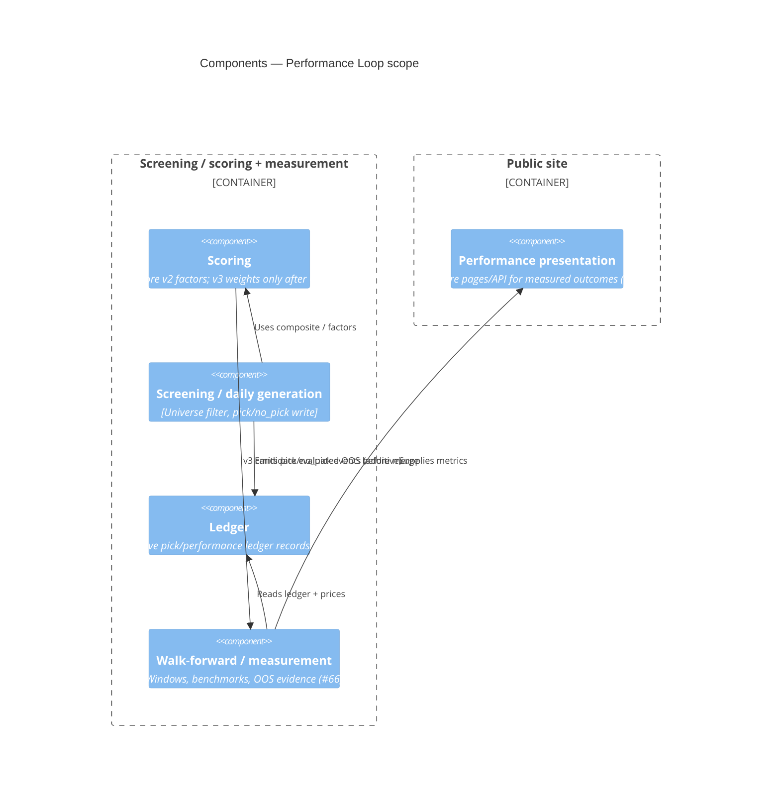

# C4 — Components (L3) — Performance Loop

Coarse ownership inside screening/scoring + future measurement presentation.
Not a class atlas (L4 optional elsewhere).

## Diagram

## Text fallback — responsibilities

| Component | One-line responsibility |
|-----------|-------------------------|
| Scoring | Compute factor scores; v2 live until merge-gate GO |
| Screening / daily generation | Produce daily pick or no_pick into content store |
| Ledger | Append-only (preferred) performance/pick ledger separate from daily JSON shape |
| Walk-forward / measurement | Apply ADR 0002/0003 rules; produce OOS evidence for ADR 0004 |
| Performance presentation | Show measured outcomes without changing pick selection logic |

Align names with [arc42 building blocks](../arc42.md). If a diagram conflicts with an
ADR Decision, the **ADR wins** — update this file.
