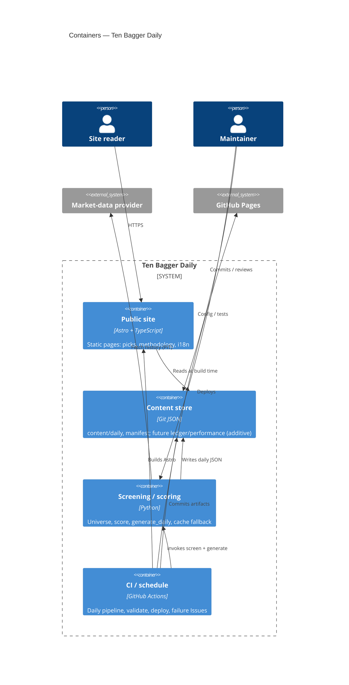

# C4 — Containers (L2)

Major runtime/deployable units inside Ten Bagger Daily.

## Diagram

## Text fallback

| Container | Tech | Responsibility |
|-----------|------|----------------|
| Public site | Astro | Render picks, methodology, KO/EN |
| Content store | Git JSON | System of record for daily picks; additive performance/ledger later |
| Screening / scoring | Python | Universe build, Score v2 (until GO), daily generate, cache on provider failure |
| CI / schedule | Actions | Orchestrate daily path; fail closed with Issues |

### Daily publication path

1. Actions starts (schedule or dispatch)  
2. Engine builds/refreshes universe and scores (PIT vs run date)  
3. Engine writes `content/daily/YYYY-MM-DD.json` (+ manifest sync)  
4. Validate content schemas (enforced schemas only)  
5. Astro build from content → deploy Pages  

Performance Loop measurement jobs (#66) will **read** daily history and **write**
separate ledger/performance artifacts — they must not mutate historical pick
semantics ([ADR 0001](../adr/0001-performance-data-storage.md)).
