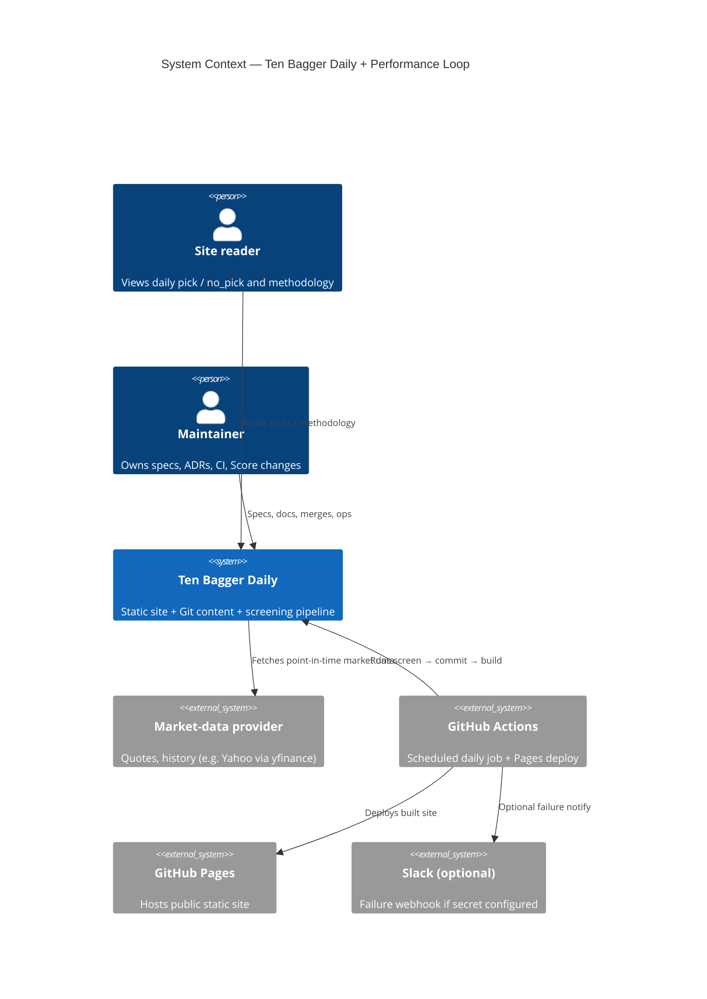

# C4 — System Context (L1)

Actors and external systems for Ten Bagger Daily / Performance Loop (Epic #74).

## Diagram

## Text fallback

| Node | Role |
|------|------|
| Site reader | Human consumer of public pages |
| Maintainer | Engineering / docs / Score gate owner |
| Ten Bagger Daily | This repository: Astro site + `content/` + `scripts/` |
| Market-data provider | External quotes/history; no look-ahead vs decision time |
| GitHub Actions | 06:00 KST schedule + manual dispatch; CI failure Issues |
| GitHub Pages | Public hosting |
| Slack (optional) | Named secret only in docs — never paste live webhook URLs |

**Edges**: Reader→site; Maintainer→repo; Actions→screen/commit/build; repo→market data;
Actions→Pages; Actions→Slack (optional).
